# SOC Lab with Active Directory, Ubuntu Splunk Server, and Sysmon

> **Part 1 of the Active Directory Project series.**
> For attack simulation and detection, see 👉 [ADDC-Attack-Detection-Simulation
(Part2)](https://github.com/ericnam-png/ADDC-Attack-Detection-Simulation)

---

## Summary

This project builds a 4-machine Active Directory home lab environment designed to support realistic attack simulation and centralized log monitoring. The lab includes a dedicated Splunk server on Ubuntu, a Windows Server 2022 Domain Controller, a Windows 11 target machine joined to the domain, and a Kali Linux attacker machine.

---

## Architecture

| Role | Machine | IP Address |
|---|---|---|
| SIEM (Splunk Server) | Ubuntu 24.04 LTS | 192.168.10.4 |
| Target 1 (Endpoint) | Windows 11 Pro (win11-T1) | 192.168.10.5 |
| Target 2 (Domain Controller) | Windows Server 2022 (ADDC-T2) | 192.168.10.6 |
| Attacker | Kali Linux | 192.168.10.7 |

- Domain: `ad.eric.local`
- Network: `192.168.10.0/24`
- All machines run on VirtualBox with a NAT network
- Sysmon + Splunk Universal Forwarder installed on both Win11 and ADDC-T2
- Logs forwarded to Ubuntu Splunk server via TCP port 9997

<p>
  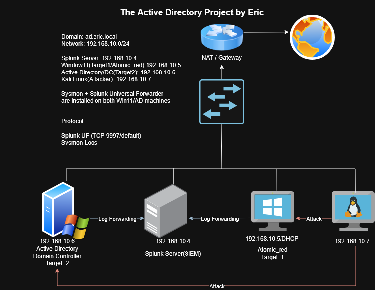
</p>

---

## Setup Steps

### 1. Virtual Machine Setup

Created four virtual machines in VirtualBox and configured them on a shared NAT network, enabling inter-machine communication while routing external connectivity through the host.

### 2. Ubuntu Splunk Server Setup

Splunk Enterprise was installed on the Ubuntu machine via CLI. A VirtualBox shared folder was used to transfer the `.deb` installer package from the host.

- Added user to `vboxsf` group and mounted the shared folder
- Installed Splunk: `sudo dpkg -i splunk-10.2.1-linux-amd64.deb`
- Enabled boot-start: `sudo ./splunk enable boot-start -user splunk`
- Enabled receiving on TCP port 9997: `sudo /opt/splunk/bin/splunk enable listen 9997`
- Verified listener: `sudo ss -tulnp | grep 9997`

<p>
  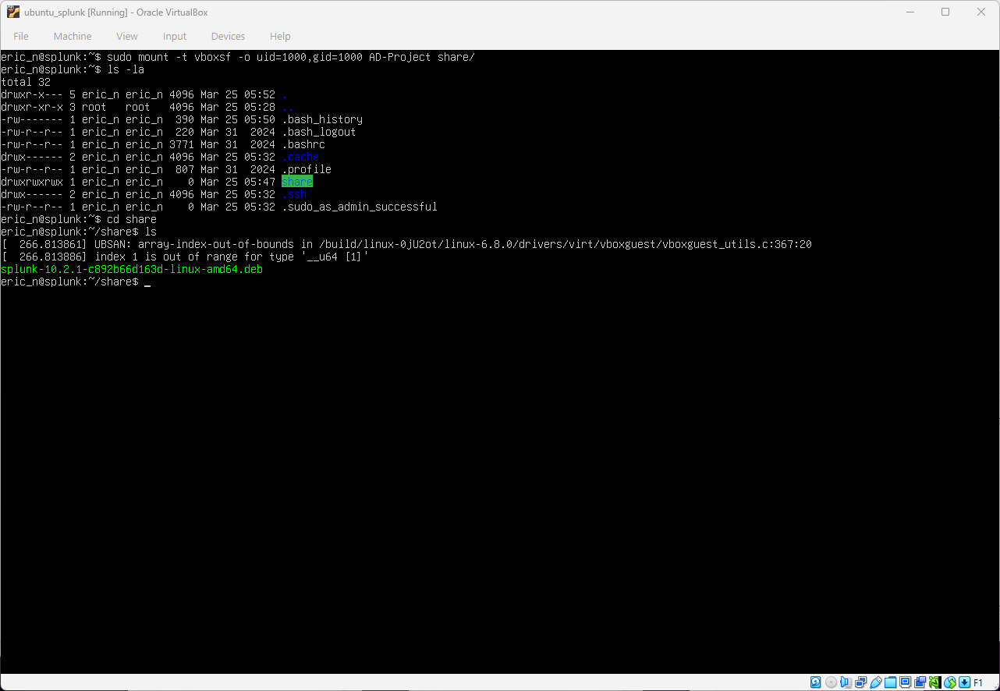
  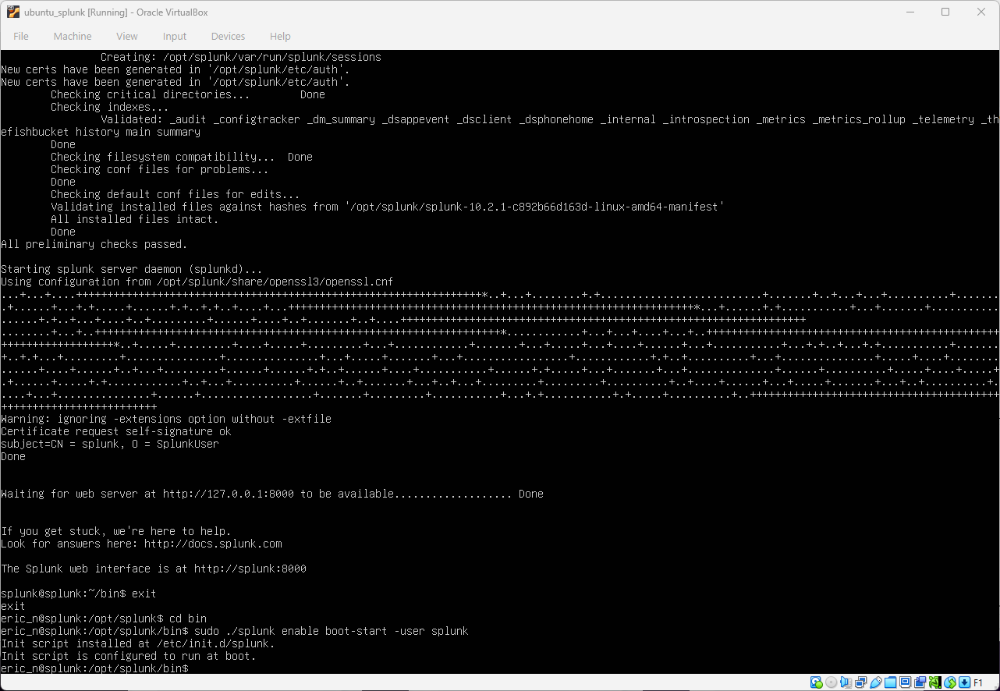
  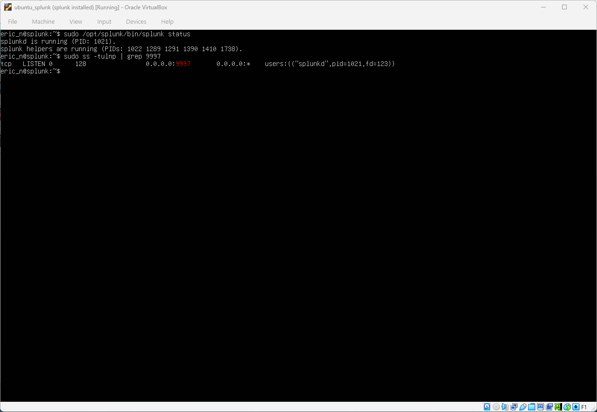
  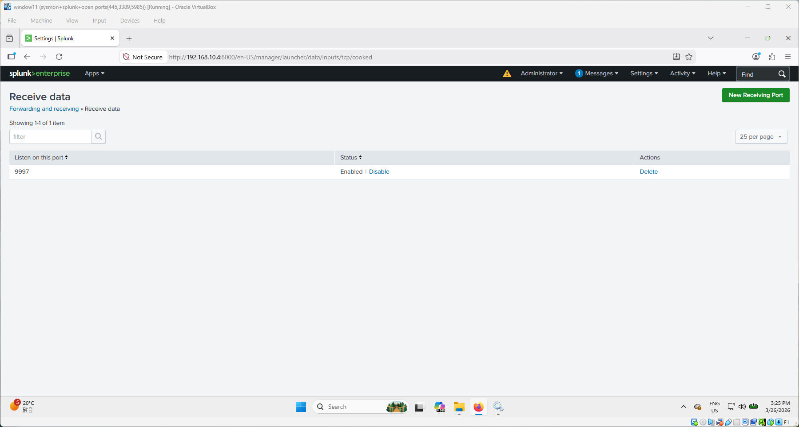
</p>

**Splunk server:** version 10.2.1 — web interface at `http://192.168.10.4:8000`, receiving port `9997`

### 3. Sysmon Deployment

Sysmon was installed on both Win11-T1 and ADDC-T2 for detailed endpoint visibility.

- Verified running via `get-service *sysmon*` in PowerShell
- Confirmed Sysmon operational logs in Event Viewer under `Microsoft-Windows-Sysmon/Operational`

### 4. Splunk Universal Forwarder — Win11 and ADDC-T2

Created a custom index named `endpoint` in Splunk and configured Splunk Universal Forwarder (v10.2.1) on both Windows machines to forward logs to the Ubuntu Splunk server via `inputs.conf`

**`inputs.conf`** (`C:\Program Files\SplunkUniversalForwarder\etc\system\local\`):

```
[WinEventLog://Application]
index = endpoint
disabled = false

[WinEventLog://Security]
index = endpoint
disabled = false

[WinEventLog://System]
index = endpoint
disabled = false

[WinEventLog://Microsoft-Windows-Sysmon/Operational]
index = endpoint
disabled = false
renderXml = true
source = XmlWinEventLog:Microsoft-Windows-Sysmon/Operational
```

**Verification:** Confirmed both hosts visible in Splunk with `index=endpoint` — 175,000+ events across Security, Sysmon, System, and Application sources from both win11-T1 and ADDC-T2.

<p>
  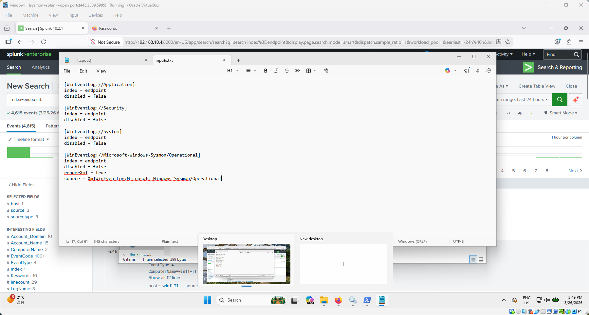
  
  Result: centralized log collection from multiple Windows hosts was validated in Splunk
</p>

### 5. Active Directory Domain Controller Setup

Configured Windows Server 2022 as an Active Directory Domain Controller.

- Renamed server to `ADDC-T2`
- Installed AD DS role via Server Manager → Add Roles and Features
- Promoted to Domain Controller — new forest, root domain `ad.eric.local`, Windows Server 2016 functional level
- Verified in Server Manager → Local Server: `Domain: ad.eric.local`

**OUs and users created in Active Directory Users and Computers:**

| OU | User | Logon Name |
|---|---|---|
| Sales | Mike Rans | mike_R |
| HR | Sorry Han | verysorryhan |

<p>
  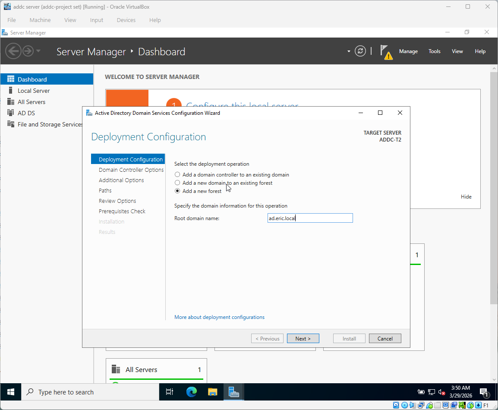
  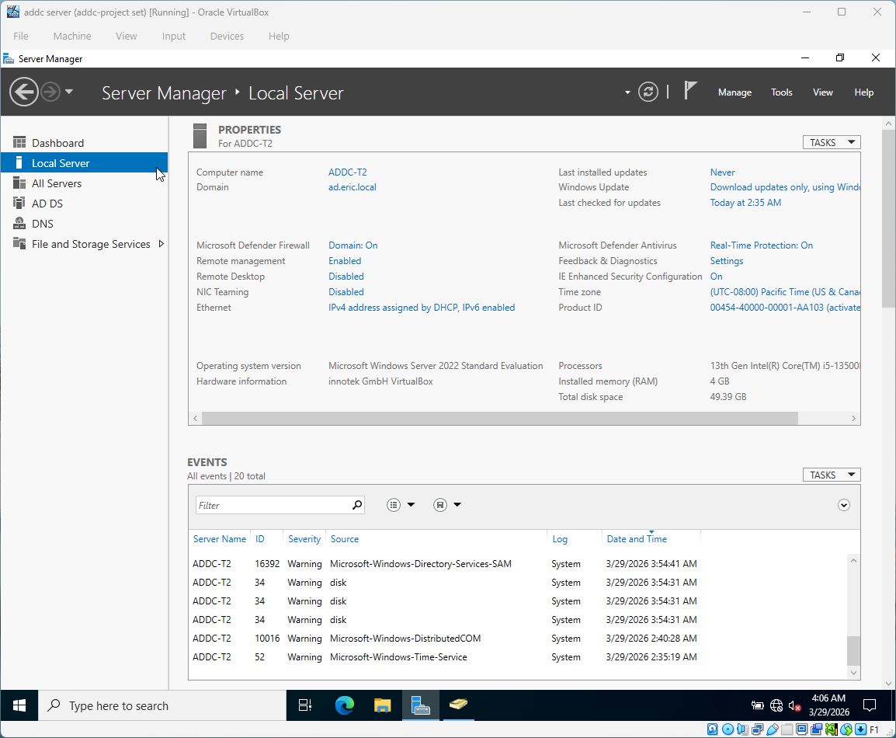
  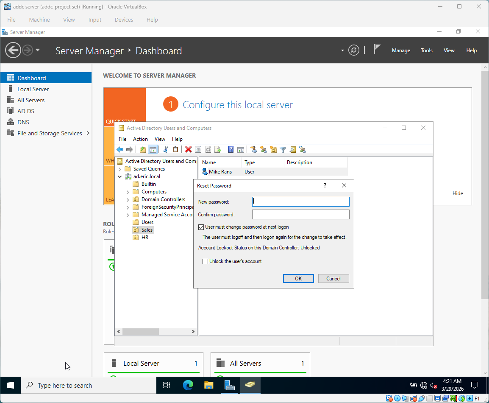
</p>

### 6. Joining Win11 to the Domain

- Set Win11 preferred DNS to `192.168.10.6` (the DC) via TCP/IPv4 Advanced settings
- Verified DNS resolution: `nslookup ad.eric.local` → resolved to `192.168.10.6`
- Joined domain via System Properties → Computer Name → Change
- Confirmed "Welcome to the AD.ERIC.LOCAL domain" and restarted
- Signed in as domain user `verysorryhan` — login successful

<p>
  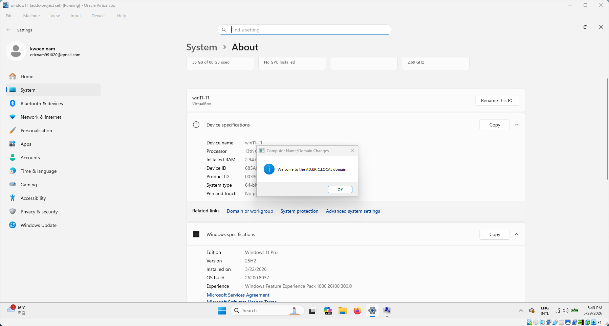
  
  
</p>

---

## Troubleshooting Notes

Real issues encountered and resolved during setup:

- **Splunk log ingestion failure due to incorrect configuration path:**  
  `inputs.conf` was initially created in the main Splunk directory instead of the Universal Forwarder directory — resolved by placing the file in `SplunkUniversalForwarder\etc\system\local`, after which log forwarding to Splunk was successful
- **Domain join DNS error:** Win11 could not contact the DC initially — resolved by correctly setting the preferred DNS to `192.168.10.6` via Advanced TCP/IP settings and flushing DNS cache
- **Sysmon log source duplication:** Both `WinEventLog` and `XmlWinEventLog` sources appeared in Splunk — expected behavior when `renderXml = true` is configured

<p>
  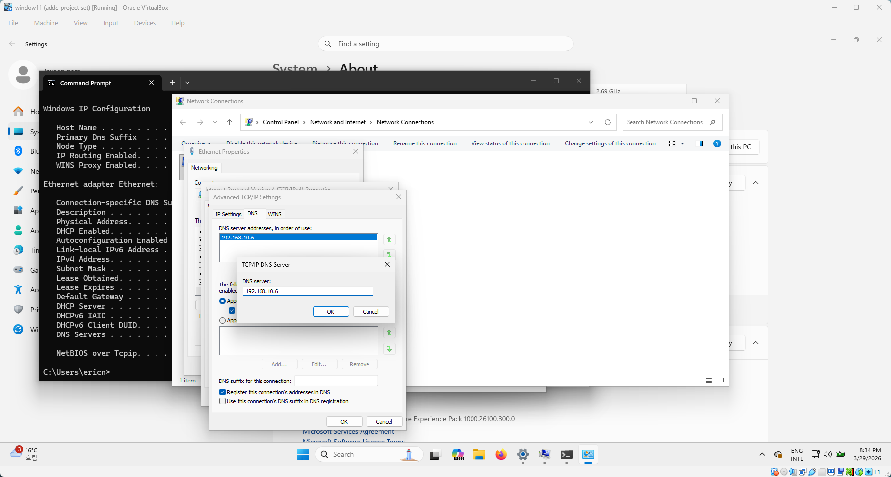
  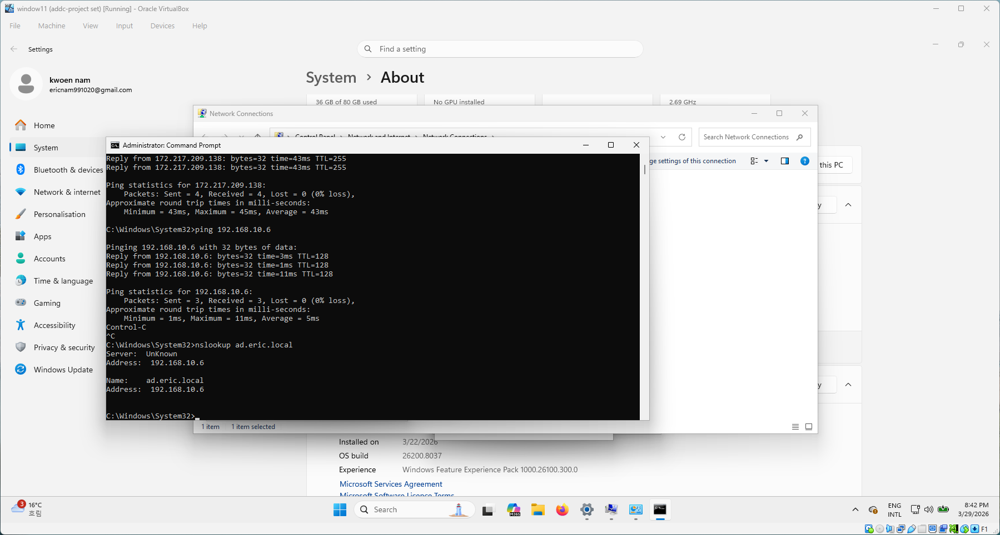
</p>

---

## What I Learned

- How to deploy Splunk Enterprise on Linux via CLI with no GUI
- How to configure Splunk Universal Forwarder on Windows machines and forward logs to a dedicated SIEM server
- How Active Directory Domain Services works — forest/domain structure, DC promotion, OU hierarchy, and domain user management
- How DNS is central to domain join operations — the DC must be the DNS server for any joining machine
- How Sysmon enriches Windows event logs with detailed process, network, and file telemetry
- Practical troubleshooting: PATH issues, password complexity requirements, DNS misconfigurations

---

## References

- [Sysmon Event ID Reference — Microsoft Docs](https://learn.microsoft.com/en-us/sysinternals/downloads/sysmon)
- [Splunk Universal Forwarder Manual](https://docs.splunk.com/Documentation/Forwarder)
- [Active Directory Domain Services Overview — Microsoft Docs](https://learn.microsoft.com/en-us/windows-server/identity/ad-ds/get-started/virtual-dc/active-directory-domain-services-overview)
- [MyDFIR YouTube Channel](https://www.youtube.com/@MyDFIR)
